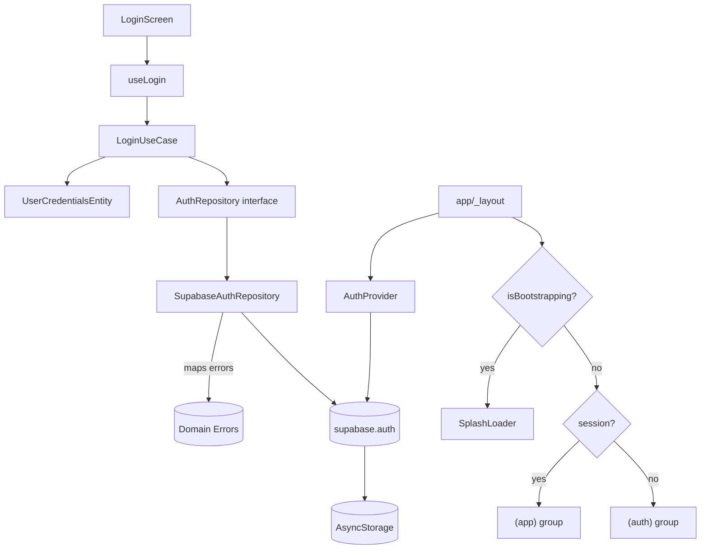

# Login & Persistent Session Plan

Two goals, one plan:

1. Implement the **login** flow reusing the Clean Architecture layers already used by signup (`schema` → `entity` → `use-case` → `repository` → `hook` → `screen`), with **domain-level error mapping** so the UI never leaks raw Supabase error strings.
2. Persist the authenticated **session for 7 days of inactivity** using Supabase's built-in token rotation, exposed app-wide through an `AuthProvider`, and protected structurally with **expo-router route groups** (no redirect flash on cold start).

Supabase Auth issues a short-lived **access token (JWT)** plus a long-lived **refresh token**. The refresh token keeps the user logged in across days; the JS client rotates it silently as long as the session is persisted and refresh runs in the foreground.

## Architecture Overview



---

## Part 1 — Login Flow

### 1. Domain: extend `AuthRepository`

```ts
// features/auth/domain/repositories/auth.repository.ts
import { UserRegistrationEntity } from "../entities/user-registration.entity";
import { UserCredentialsEntity } from "../entities/user-credentials.entity";

export interface AuthRepository {
  signUp(entity: UserRegistrationEntity): Promise<{ id: string }>;
  login(entity: UserCredentialsEntity): Promise<void>;
  logout(): Promise<void>;
}
```

`login` returns `void` on purpose: the `AuthProvider` (see Part 2) listens to `onAuthStateChange` and is the single source of truth for session/user. The hook does not need to thread user data through the UI.

### 2. Domain: auth errors

Define a small discriminated set so the UI can react without parsing strings.

```ts
// features/auth/domain/errors/auth.errors.ts
export class AuthError extends Error {
  constructor(
    public readonly code: AuthErrorCode,
    message: string,
  ) {
    super(message);
  }
}

export type AuthErrorCode =
  | "INVALID_CREDENTIALS"
  | "EMAIL_NOT_CONFIRMED"
  | "RATE_LIMITED"
  | "NETWORK"
  | "UNKNOWN";
```

### 3. Domain: `UserCredentialsEntity`

Normalizes email (trim + lowercase) at the domain boundary.

```ts
// features/auth/domain/entities/user-credentials.entity.ts
import type { LoginFormData } from "../../schemas/login.schema";

export class UserCredentialsEntity {
  private constructor(private readonly data: LoginFormData) {}

  static create(data: LoginFormData) {
    return new UserCredentialsEntity({
      email: data.email.trim().toLowerCase(),
      password: data.password,
    });
  }

  get email() {
    return this.data.email;
  }
  get password() {
    return this.data.password;
  }
}
```

### 4. Infrastructure: `SupabaseAuthRepository`

Implements `login`/`logout` and **maps Supabase errors to domain errors**. Note the error classification: to avoid user enumeration we collapse `invalid_credentials` and "user not found" into a single `INVALID_CREDENTIALS`. Internally we still call Supabase's own `signInWithPassword` and `auth.signOut()` — those are external API names and stay unchanged.

```ts
async login(entity: UserCredentialsEntity): Promise<void> {
  const { data, error } = await supabase.auth.signInWithPassword({
    email: entity.email,
    password: entity.password,
  });

  if (error) throw mapSupabaseAuthError(error);
  if (!data.user) throw new AuthError("INVALID_CREDENTIALS", "");
}

async logout(): Promise<void> {
  const { error } = await supabase.auth.signOut();
  if (error) throw mapSupabaseAuthError(error);
}
```

```ts
// features/auth/infrastructure/supabase-error-mapper.ts
export function mapSupabaseAuthError(
  err: AuthError | PostgrestError,
): AuthError {
  if (err.message.includes("Email not confirmed"))
    return new AuthError("EMAIL_NOT_CONFIRMED", "");
  if (err.status === 429) return new AuthError("RATE_LIMITED", "");
  if (err.name === "AuthRetryableFetchError")
    return new AuthError("NETWORK", "");
  // Collapses "Invalid login credentials" AND any user-not-found variants
  if (err.status === 400 || err.status === 401)
    return new AuthError("INVALID_CREDENTIALS", "");
  return new AuthError("UNKNOWN", "");
}
```

### 5. Use case: `LoginUseCase`

```ts
// features/auth/use-cases/login.use-case.ts
export class LoginUseCase {
  constructor(private readonly authRepository: AuthRepository) {}
  async execute(raw: LoginFormData): Promise<void> {
    const entity = UserCredentialsEntity.create(raw);
    await this.authRepository.login(entity);
  }
}
```

### 6. Hook: `useLogin`

Mirrors `useSignup` but reads domain errors and renders UI-safe Portuguese messages. No raw Supabase text ever reaches the user.

```ts
// features/auth/hooks/use-login.ts
const UI_MESSAGES: Record<AuthErrorCode, string> = {
  INVALID_CREDENTIALS: "E-mail ou senha inválidos.",
  EMAIL_NOT_CONFIRMED: "Confirme seu e-mail antes de entrar.",
  RATE_LIMITED: "Muitas tentativas. Tente novamente em alguns minutos.",
  NETWORK: "Sem conexão. Verifique sua internet.",
  UNKNOWN: "Não foi possível entrar. Tente novamente.",
};

export function useLogin() {
  const [isLoading, setIsLoading] = useState(false);
  // Navigation is NOT done here — the AuthProvider + route groups handle it.

  const handleLogin = async (data: LoginFormData) => {
    try {
      setIsLoading(true);
      await loginUseCase.execute(data);
    } catch (error) {
      const code = error instanceof AuthError ? error.code : "UNKNOWN";
      Alert.alert("Erro ao entrar", UI_MESSAGES[code]);
    } finally {
      setIsLoading(false);
    }
  };

  return { handleLogin, isLoading };
}
```

Note: **no `router.replace("/home")`** inside the hook. The route group guard (Part 2 §4) automatically moves the user to `(app)/home` when the `AuthProvider` picks up the `SIGNED_IN` event. One source of truth for routing.

### 7. Screen: wire `LoginScreen`

Replace the placeholder in `features/auth/components/login-screen.tsx`:

- Bind `handleSubmit(handleLogin)` to the button.
- Forward `isLoading` to `Button` as `disabled` / loading state.
- Remove the current `router.push("/find-pet")`.

---

## Part 2 — Persistent Session (7 days, inactivity-based)

### How Supabase persistence works

- **Access token (JWT)**: short-lived (default **1h**). Used for every RLS/API call.
- **Refresh token**: long-lived, rotated on every refresh. As long as it's valid and stored, the user stays logged in.

`lib/supabase.ts` is already configured with the necessary client-side knobs:

```ts
// lib/supabase.ts  (already in place)
createClient(url, key, {
  auth: {
    storage: AsyncStorage,
    autoRefreshToken: true,
    persistSession: true,
    detectSessionInUrl: false,
  },
});
```

What's missing:

1. Server-side token lifetimes tuned for **7-day inactivity**.
2. Global state via `AuthProvider` / `useAuth`.
3. Structural route protection (route groups) with a splash gate.
4. Foreground/background refresh control.

### 1. Configure token lifetimes in Supabase (Dashboard)

Since this project has no `supabase/config.toml`, configuration lives in **Supabase Dashboard → Authentication → Sessions** (and → **Providers → Email** for reuse-interval).

| Setting                      | Value                   | Rationale                                                                                                                            |
| ---------------------------- | ----------------------- | ------------------------------------------------------------------------------------------------------------------------------------ |
| JWT expiry                   | `3600` (1 h)            | Default. Short is safer; refresh token does the heavy lifting.                                                                       |
| Refresh token rotation       | **enabled**             | Each refresh invalidates the previous token — limits replay of a leaked one.                                                         |
| Refresh token reuse interval | `10` s                  | Default. Tolerates race conditions in rotation.                                                                                      |
| **Inactivity timeout**       | **`604800` s (7 days)** | After 7 days with no session refresh, the user must log in again.                                                                    |
| Time-box (absolute session)  | **unset / disabled**    | An actively-used session keeps rolling. Re-login is only forced after 7 days of **inactivity**, not on an arbitrary weekly schedule. |

> Decision: we chose **inactivity-only** (not inactivity + 7d absolute cap). A cap equal to inactivity would kick out even active daily users every week, which is almost never the desired UX for a consumer app. If compliance later demands an absolute cap, set it ≫ inactivity (e.g. 90 days).

### 2. Global auth state: `AuthProvider` / `useAuth`

```ts
// features/auth/context/auth.context.tsx
type AuthState = {
  session: Session | null;
  user: User | null;
  isBootstrapping: boolean; // true ONLY during the first hydrate-from-storage
  logout: () => Promise<void>;
};
```

Responsibilities:

- On mount: call `supabase.auth.getSession()` to hydrate from `AsyncStorage`; set `isBootstrapping = false` when done.
- Subscribe to `supabase.auth.onAuthStateChange((event, session) => …)` and update state on `SIGNED_IN`, `SIGNED_OUT`, `TOKEN_REFRESHED`, `USER_UPDATED`. Unsubscribe on unmount.
- Expose `logout()` that delegates to `SupabaseAuthRepository.logout()`.

### 3. Mount the provider + splash gate in `app/_layout.tsx`

```tsx
export default function RootLayout() {
  // ...fonts, theming...
  return (
    <AuthProvider>
      <AuthGate>
        <Stack screenOptions={{ headerShown: false }} />
      </AuthGate>
    </AuthProvider>
  );
}

function AuthGate({ children }: { children: React.ReactNode }) {
  const { isBootstrapping } = useAuth();
  if (isBootstrapping) return <SplashLoader />;
  return <>{children}</>;
}
```

The splash gate exists so the first frame after cold start is never a route — it's a loader — which eliminates the `(auth) → (app)` flash that a `useEffect` redirect would produce.

### 4. Structural route protection via route groups

Reorganize `app/`:

```
app/
  _layout.tsx            ← AuthProvider + AuthGate (above)
  (auth)/
    _layout.tsx          ← redirects to /home if session exists
    login.tsx
    signup.tsx
  (app)/
    _layout.tsx          ← redirects to /login if session is null
    home.tsx
    find-pet.tsx
  index.tsx              ← redirects based on session (entry point)
```

Each group layout enforces its own rule using expo-router's `<Redirect>` component (synchronous, no flash):

```tsx
// app/(app)/_layout.tsx
export default function AppLayout() {
  const { session } = useAuth();
  if (!session) return <Redirect href="/login" />;
  return <Stack screenOptions={{ headerShown: false }} />;
}

// app/(auth)/_layout.tsx
export default function AuthLayout() {
  const { session } = useAuth();
  if (session) return <Redirect href="/home" />;
  return <Stack screenOptions={{ headerShown: false }} />;
}
```

Why groups instead of a `useEffect` guard:

- `<Redirect>` is synchronous and chosen during render — no one-frame flash.
- The protected-route list is **structural** (the folder it lives in), not a manually maintained array.
- Signing in/out automatically triggers the right group without the hook calling `router.replace`.

### 5. AppState-aware auto-refresh

React Native pauses JS timers when backgrounded, so Supabase's auto-refresh can miss cycles. Wire the official pattern once, in the root `_layout`:

```ts
import { AppState } from "react-native";

useEffect(() => {
  const sub = AppState.addEventListener("change", (state) => {
    if (state === "active") supabase.auth.startAutoRefresh();
    else supabase.auth.stopAutoRefresh();
  });
  return () => sub.remove();
}, []);
```

This is what actually enables the 7-day silent-login UX: a user who opens the app on day 6 has their refresh token exchanged the moment the app becomes active, resetting the inactivity window to zero.

### 6. Logout

Expose `logout` from `useAuth` and wire it from an authenticated screen (e.g. a future profile screen, or temporarily a button on `home.tsx`). Supabase emits its `SIGNED_OUT` event, the provider clears state, `(app)/_layout` re-renders, `<Redirect href="/login" />` fires. No manual navigation needed.

---

## File Map

| Action | Path                                                                             |
| ------ | -------------------------------------------------------------------------------- |
| modify | `features/auth/domain/repositories/auth.repository.ts`                           |
| create | `features/auth/domain/errors/auth.errors.ts`                                     |
| create | `features/auth/domain/entities/user-credentials.entity.ts`                       |
| create | `features/auth/infrastructure/supabase-error-mapper.ts`                          |
| modify | `features/auth/infrastructure/supabase-auth.repository.ts`                       |
| create | `features/auth/use-cases/login.use-case.ts`                                      |
| create | `features/auth/hooks/use-login.ts`                                               |
| modify | `features/auth/components/login-screen.tsx`                                      |
| create | `features/auth/context/auth.context.tsx`                                         |
| create | `components/ui/splash-loader.tsx` (or reuse existing loader)                     |
| move   | `app/login.tsx` → `app/(auth)/login.tsx`                                         |
| move   | `app/signup.tsx` → `app/(auth)/signup.tsx`                                       |
| move   | `app/home.tsx` → `app/(app)/home.tsx`                                            |
| move   | `app/find-pet.tsx` → `app/(app)/find-pet.tsx`                                    |
| create | `app/(auth)/_layout.tsx`                                                         |
| create | `app/(app)/_layout.tsx`                                                          |
| modify | `app/_layout.tsx` (wrap with `AuthProvider` + `AuthGate`, add AppState listener) |
| modify | `app/index.tsx` (redirect based on `useAuth().session`)                          |
| modify | Supabase Dashboard → Authentication → Sessions (7-day inactivity, no time-box)   |

## Acceptance Criteria

- Valid credentials: button shows loading, then user lands on `/home` with no visible flash of `/login`.
- Invalid credentials: generic message `"E-mail ou senha inválidos."` — no distinction between "wrong password" and "user doesn't exist".
- Specific messages shown for: unconfirmed email, rate limiting, network failure.
- Killing and reopening the app within **7 days** of the last use lands directly on `/home`.
- After 7+ days of not opening the app, reopening lands on `/login`.
- Explicit logout redirects to `/login`; a cold start afterwards stays on `/login`.
- No `console.log` of credentials or tokens anywhere.
- `useAuth()` returns a populated `session`/`user` inside any `(app)` screen.

---

## Follow-ups (out of scope for this plan)

Tracked here so they aren't forgotten, but explicitly deferred:

- **P2 — `expo-secure-store` adapter for the token store.** Replace `AsyncStorage` with an adapter over `expo-secure-store` (Keychain/Keystore), falling back to `AsyncStorage` for values > 2 KB. Lower priority at 7 days than at 30, still recommended before launch.
- **P2 — "Lembrar de mim" toggle on the login screen.** Default on; when off, do not persist the session (`persistSession: false` path or storage wipe on `SIGNED_IN`). Useful for shared devices.
- **P2 — Unit tests.** `UserCredentialsEntity` (normalization), `LoginUseCase` with a fake `AuthRepository`, `mapSupabaseAuthError`, `AuthProvider` with a mocked `supabase.auth`.
- **P3 — `@tanstack/react-query` for mutations.** Replace manual `useState` loading/error in `useLogin` / `useSignup` with `useMutation` for retry and consistency as more hooks arrive.
- **P3 — Password recovery deep link.** `supabase/templates/recovery.html` already exists; wire `expo-linking` + `supabase.auth.exchangeCodeForSession` so the recovery email actually reaches a working screen.
- **P3 — Split `AuthContext` into `SessionContext` + `UserContext`** if re-render cost becomes measurable, or move to Zustand.
