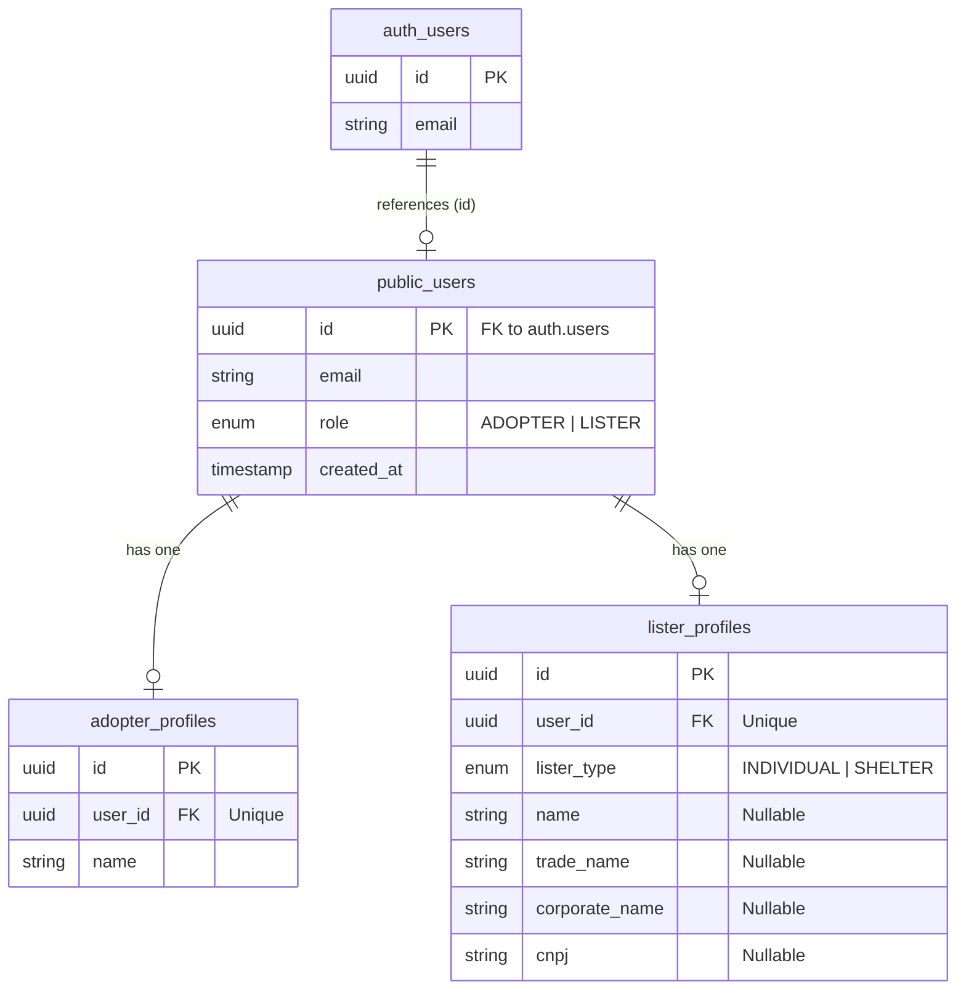

# Supabase Entity Modeling Plan

This plan outlines the database schema and integration steps for implementing the `ADOPTER` and `LISTER` roles in Supabase. It uses PostgreSQL features like Enums and Row Level Security (RLS), and integrates with Supabase Auth (`auth.users`).

## Database Architecture



## Implementation Steps

### 1. Create Enums and Tables (SQL Migration)

We will create a migration script in Supabase to define the custom types and tables.

```sql
-- Create Enums
CREATE TYPE user_role AS ENUM ('ADOPTER', 'LISTER');
CREATE TYPE lister_type AS ENUM ('INDIVIDUAL', 'SHELTER');

-- Create Base Users Table (Syncs with auth.users)
CREATE TABLE public.users (
  id UUID REFERENCES auth.users(id) ON DELETE CASCADE PRIMARY KEY,
  email TEXT NOT NULL,
  role user_role NOT NULL,
  created_at TIMESTAMPTZ DEFAULT NOW()
);

-- Create Adopter Profiles
CREATE TABLE public.adopter_profiles (
  id UUID PRIMARY KEY DEFAULT uuid_generate_v4(),
  user_id UUID REFERENCES public.users(id) ON DELETE CASCADE UNIQUE NOT NULL,
  name TEXT NOT NULL,
  created_at TIMESTAMPTZ DEFAULT NOW()
);

-- Create Lister Profiles
CREATE TABLE public.lister_profiles (
  id UUID PRIMARY KEY DEFAULT uuid_generate_v4(),
  user_id UUID REFERENCES public.users(id) ON DELETE CASCADE UNIQUE NOT NULL,
  lister_type lister_type NOT NULL,
  name TEXT,
  trade_name TEXT,
  corporate_name TEXT,
  cnpj TEXT,
  created_at TIMESTAMPTZ DEFAULT NOW()
);
```

### 2. Configure Row Level Security (RLS)

Supabase requires RLS to secure data access from the client.

```sql
-- Enable RLS
ALTER TABLE public.users ENABLE ROW LEVEL SECURITY;
ALTER TABLE public.adopter_profiles ENABLE ROW LEVEL SECURITY;
ALTER TABLE public.lister_profiles ENABLE ROW LEVEL SECURITY;

-- Basic Policies (Users can read/update their own data)
CREATE POLICY "Users can view their own record" ON public.users FOR SELECT USING (auth.uid() = id);
CREATE POLICY "Users can view their own adopter profile" ON public.adopter_profiles FOR SELECT USING (auth.uid() = user_id);
CREATE POLICY "Users can update their own adopter profile" ON public.adopter_profiles FOR UPDATE USING (auth.uid() = user_id);

-- Listers are usually public so adopters can see who is donating the pet
CREATE POLICY "Anyone can view lister profiles" ON public.lister_profiles FOR SELECT USING (true);
CREATE POLICY "Listers can update their own profile" ON public.lister_profiles FOR UPDATE USING (auth.uid() = user_id);
```

### 3. Frontend Integration (Signup Flow)

Update the signup logic to map the form data from `features/auth/schemas/signup.schema.ts` to the Supabase tables.

1. Call `supabase.auth.signUp()`.
2. After successful auth creation, insert into `public.users` with the mapped role.
3. Insert into the respective profile table:
   - If `data.role === "adotante"` -> Insert into `adopter_profiles`.
   - If `data.role === "doador"` -> Insert into `lister_profiles` with `lister_type = 'INDIVIDUAL'`.
   - If `data.role === "abrigo"` -> Insert into `lister_profiles` with `lister_type = 'SHELTER'`.
