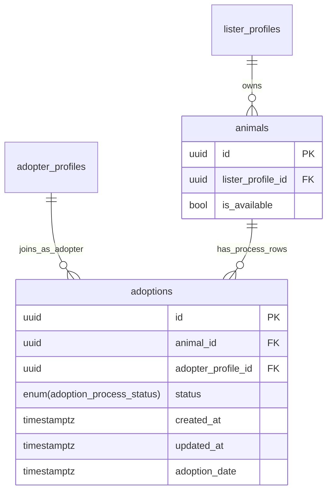

# Adoption Table Modeling Plan

Implement a dedicated `public.adoptions` model to represent the adoption process between `animals` and `adopter_profiles`, while keeping lister ownership from `animals.lister_profile_id`. The adoption table will be the canonical source of process tracking, and `animals` will keep only availability information.

## Scope and confirmed decisions

- Canonical process tracking lives in `adoptions` (not in `animals`).
- `animals` should only indicate if the pet is available or not.
- One animal can have multiple adoption records over time (unrestricted history).
- Context comes from existing schema in [`../../supabase/migrations/20260426000000_animals_table.sql`](../../supabase/migrations/20260426000000_animals_table.sql) and plan style in [`animal_table_modeling_19dfb9c2.plan.md`](animal_table_modeling_19dfb9c2.plan.md).

## Files to create / modify

- **New migration**: `supabase/migrations/20260511000000_adoptions_table.sql`
  - Follow the style of [`supabase/migrations/20260426000000_animals_table.sql`](../../supabase/migrations/20260426000000_animals_table.sql): `CREATE TYPE` first, then `CREATE TABLE`, indexes, `ALTER TABLE … ENABLE ROW LEVEL SECURITY`, `CREATE POLICY` per role/action, `CREATE TRIGGER`.
- **Modify `animals` table** (in the same migration or as a dedicated prior migration):
  - `ALTER TABLE public.animals ADD COLUMN is_available BOOLEAN NOT NULL DEFAULT true;`
  - `animals.adoption_status` is **soft-deprecated**: the column is kept to avoid a breaking change, but `is_available` becomes the sole filtering source of truth at the app layer. Document this with a SQL comment in the migration.

## Availability boundary

- Add `animals.is_available BOOLEAN NOT NULL DEFAULT true`.
- Deprecate `animals.adoption_status` for business decisions (soft deprecation — column kept, not dropped).
- Animal listing/search should filter by `animals.is_available`.
- Process lifecycle, adopter assignment, and adoption dates should come from `adoptions`.

## Target data model

Create `public.adoptions` with:

- `id UUID PRIMARY KEY DEFAULT uuid_generate_v4()`
- `animal_id UUID NOT NULL REFERENCES public.animals(id) ON DELETE CASCADE`
- `adopter_profile_id UUID REFERENCES public.adopter_profiles(id) ON DELETE SET NULL`
- `status adoption_process_status NOT NULL DEFAULT 'UNDER_REVIEW'` (see enum below)
- `created_at TIMESTAMPTZ NOT NULL DEFAULT NOW()`
- `adoption_date TIMESTAMPTZ` (nullable; set when status reaches `ADOPTED`)
- `updated_at TIMESTAMPTZ NOT NULL DEFAULT NOW()`
- `notes TEXT` (internal context for shelter/donor).
- `cancel_reason TEXT` (optional when status is `CANCELED` or `REJECTED`).
- `status_changed_at TIMESTAMPTZ` (audit-friendly timeline support).
- `visit_scheduled_for TIMESTAMPTZ` (planned date/time when status is `VISIT_PENDING`).
- `visited_at TIMESTAMPTZ` (actual visit completion timestamp when status is `VISITED`).
- `adaptation_started_at TIMESTAMPTZ` (start of trial period for `IN_ADAPTATION`).
- `adaptation_ended_at TIMESTAMPTZ` (end of trial period before final decision).
- `decision_notes TEXT` (short rationale for `ADOPTED`, `REJECTED`, or `CANCELED`).

### Enum type

```sql
CREATE TYPE adoption_process_status AS ENUM (
  'UNDER_REVIEW',
  'IN_PROGRESS',
  'VISIT_PENDING',
  'IN_ADAPTATION',
  'VISITED',
  'ADOPTED',
  'CANCELED',
  'REJECTED'
);
```

## Relationship and consistency rules

- `adoptions` does not store `lister_profile_id`; owner is derived from `animals.lister_profile_id` through `animal_id`.
- Use normalized ownership checks in queries and RLS through joins to `animals` and `lister_profiles`.
- Keep `animals` availability-only:
  - `animals.is_available` is the only adoption-related field in `animals`.
  - All process flow decisions read from `adoptions.status`.

## RLS policy design

Enable RLS on `public.adoptions` and apply policies using descriptive names (follow the `"Role can action their own X"` convention from the project):

- `"Listers can view their own adoption processes"` — SELECT where `adoptions.animal_id` belongs to an `animals` row owned by their `lister_profile`.
- `"Listers can insert adoption processes for their animals"` — INSERT with CHECK on same ownership join.
- `"Listers can update their own adoption processes"` — UPDATE USING + WITH CHECK on same ownership join.
- `"Adopters can view their own adoption processes"` — SELECT where `adopter_profile_id` matches `auth.uid()` lookup.
- **Cross-role safety**: no user can update rows outside their linked profile.
- **Catalog reads**: public browsing should remain in `animals` using `is_available`, not direct `adoptions` reads.

Prefer one permissive policy per role/action path to avoid repeated "multiple permissive policies" lint warnings.

## Indexing strategy

All indexes follow the `idx_{table}_{column(s)}` naming convention (e.g. `idx_animals_lister_profile_id` in the existing migration).

- `idx_adoptions_animal_id` on `(animal_id)` — for timeline/history queries by animal.
- `idx_adoptions_adopter_profile_id_created_at` on `(adopter_profile_id, created_at DESC)` — for adopter journey views.
- `idx_adoptions_status_created_at` on `(status, created_at DESC)` — for process tracking.
- Reuse existing `idx_animals_lister_profile_id` for owner dashboard queries that join from `adoptions` to `animals`.
- Add `idx_animals_is_available_created_at` on `animals(is_available, created_at DESC)` — for available-pet listing (replaces `adoption_status`-based index over time).

## Lifecycle rules

- On animal creation by lister: `animals.is_available = true`.
- Candidate enters queue with `status = 'UNDER_REVIEW'`.
- Active progress uses `status = 'IN_PROGRESS'`.
- Visit scheduling uses `status = 'VISIT_PENDING'`.
- Optional trial period uses `status = 'IN_ADAPTATION'`.
- After the adopter visits the pet, set `status = 'VISITED'`.
- Success path: `status = 'ADOPTED'` requires `adoption_date` and sets `animals.is_available = false`.
- Exit paths: `status = 'CANCELED'` or `status = 'REJECTED'` should store `cancel_reason`.
- Keep transitions validated in app/domain layer; enforce critical invariants in DB where feasible.

## Migration and rollout order

1. Add `animals.is_available BOOLEAN NOT NULL DEFAULT true` via `ALTER TABLE public.animals ADD COLUMN`. Add SQL comment marking `adoption_status` as soft-deprecated.
2. Create `adoption_process_status` enum + `adoptions` table + constraints + indexes (`idx_adoptions_*`, `idx_animals_is_available_created_at`).
3. Enable RLS and create role-safe policies with descriptive names (see RLS section above).
4. Attach trigger: `CREATE TRIGGER set_updated_at_adoptions BEFORE UPDATE ON public.adoptions FOR EACH ROW EXECUTE FUNCTION public.set_updated_at();`
5. Implement normalized ownership checks for `adoptions` via `animal_id` joins.
6. Define read model queries for lister and adopter dashboards.
7. **Verify migration in local Supabase** and confirm rollback behavior.
8. Seed a minimal sample dataset (one animal with a full lifecycle from `UNDER_REVIEW` → `ADOPTED`) to validate query patterns and RLS.
9. Prepare follow-up plan for application-layer integration (repository/use-case/hooks/screens).

## Architecture view



## Acceptance criteria

- `animals` only carries availability for adoption visibility (`is_available`).
- `adoptions` table exists and links `animals` (which carries lister ownership via `lister_profile_id`) and optional `adopter_profiles`.
- `adoption_process_status` enum and all process lifecycle values are defined in SQL (`UNDER_REVIEW`, `IN_PROGRESS`, `VISIT_PENDING`, `IN_ADAPTATION`, `VISITED`, `ADOPTED`, `CANCELED`, `REJECTED`).
- RLS allows only intended read/write access for lister/adopter actors; policies use descriptive quoted names.
- Indexes follow `idx_{table}_{column}` convention and support lister/adopter dashboards and status filtering.
- Lister ownership for adoptions is resolved from `animals.lister_profile_id` (single source of truth, not stored in `adoptions`).
- `set_updated_at_adoptions` trigger is attached and functions correctly on row update.
- Migration verified in local Supabase with rollback confirmed.
