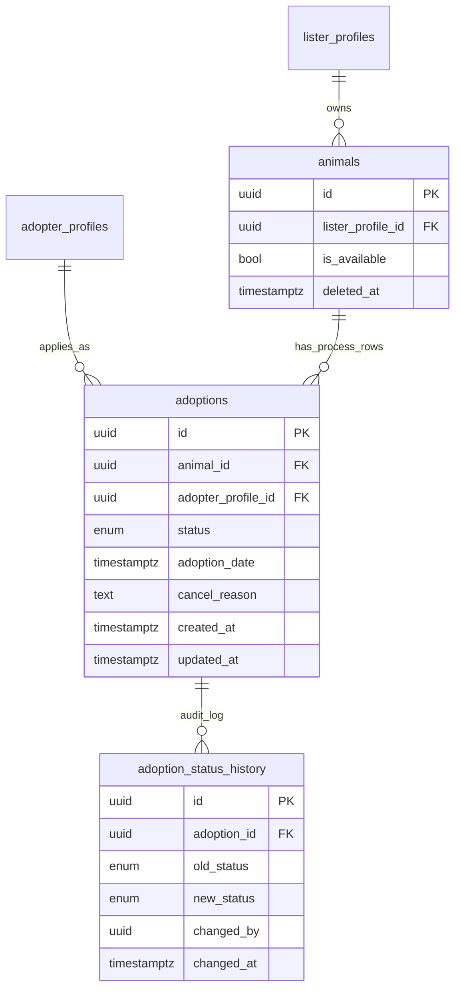

# Adoption Table Modeling Plan

Implement a dedicated `public.adoptions` model to represent the adoption process between `animals` and `adopter_profiles`. Process tracking is canonical to `adoptions`; `animals` carries only availability state. Adopters initiate applications; listers manage all status transitions. An append-only `adoption_status_history` table provides a full audit trail via trigger.

## Scope and confirmed decisions

- Canonical process tracking lives in `adoptions`.
- `animals` carries `is_available` (availability) and `deleted_at` (soft delete). No physical deletes.
- One animal can have multiple adoption records over time (history unrestricted).
- **Adopter-initiated**: adopter creates the adoption row at `IN_PROGRESS`; lister owns all subsequent transitions.
- `is_available` is synced atomically by a trigger on `adoptions` and on `animals.deleted_at`.
- All status changes are appended to `adoption_status_history` by the same trigger.
- `status_changed_at` is omitted from `adoptions` — derive from `adoption_status_history` instead.

## Files to create / modify

- **New migration**: `supabase/migrations/20260511000000_adoptions_table.sql`
  - Follow the style of [`supabase/migrations/20260426000000_animals_table.sql`](../../supabase/migrations/20260426000000_animals_table.sql) and the prior plan [`animal_table_modeling_19dfb9c2.plan.md`](animal_table_modeling_19dfb9c2.plan.md): `CREATE TYPE` first, then `CREATE TABLE`, indexes, `ALTER TABLE … ENABLE ROW LEVEL SECURITY`, `CREATE POLICY` per role/action, `CREATE TRIGGER`.
- **Modify `animals` table** (in the same migration):
  - Backfill and add `is_available BOOLEAN NOT NULL DEFAULT true` (see Availability boundary section).
  - `ALTER TABLE public.animals ADD COLUMN deleted_at TIMESTAMPTZ;`
  - Add SQL comment marking `adoption_status` as soft-deprecated.
- **Update existing policies** in the same migration:
  - Drop and recreate `"Anyone can view available animals"` on `animals` to use `is_available = true AND deleted_at IS NULL`.
  - Drop and recreate `"Anyone can view animal photos"` on `animal_photos` to join `animals` using `is_available = true AND deleted_at IS NULL`.
  - `CREATE OR REPLACE FUNCTION get_nearby_animals(...)` — replace `adoption_status = 'AVAILABLE'` with `is_available = true AND deleted_at IS NULL`.
  - **Drop** `"Listers can delete their own animals"` policy on `animals` — no replacement. Physical deletes are no longer permitted; soft-delete via `deleted_at` is the only supported path.
  - Revoke column-level UPDATE privilege on `animals.is_available` from `authenticated` and `anon` roles (availability is managed exclusively by SECURITY DEFINER triggers).

## Availability boundary

- `animals.is_available` is the sole availability signal for public listings and catalog reads.
- `animals.adoption_status` is soft-deprecated: column kept for backwards compatibility, not used in new logic.
- `animals.deleted_at` enables soft deletion. Setting it triggers `is_available = false`.

### Backfill

```sql
-- Step 1: add nullable first
ALTER TABLE public.animals ADD COLUMN is_available BOOLEAN;

-- Step 2: backfill from existing status
UPDATE public.animals
SET is_available = (adoption_status = 'AVAILABLE');

-- Step 3: lock in NOT NULL and default
ALTER TABLE public.animals
  ALTER COLUMN is_available SET DEFAULT true,
  ALTER COLUMN is_available SET NOT NULL;

-- Verification query (run after migration, before deploying)
SELECT adoption_status, is_available, COUNT(*)
FROM public.animals
GROUP BY adoption_status, is_available;
```

Add soft-delete column:

```sql
ALTER TABLE public.animals ADD COLUMN deleted_at TIMESTAMPTZ;

COMMENT ON COLUMN public.animals.adoption_status
  IS 'Soft-deprecated. Use is_available for availability filtering. Kept for backwards compatibility.';
```

## Target data model

### `public.adoption_process_status` enum

```sql
CREATE TYPE adoption_process_status AS ENUM (
  'UNDER_REVIEW',
  'IN_PROGRESS',
  'VISIT_PENDING',
  'VISITED',
  'IN_ADAPTATION',
  'ADOPTED',
  'CANCELED',
  'REJECTED'
);
```

### `public.adoptions`

| Column                  | Type                      | Constraints / Default                                                       |
| ----------------------- | ------------------------- | --------------------------------------------------------------------------- |
| `id`                    | `UUID`                    | `PRIMARY KEY DEFAULT uuid_generate_v4()`                                    |
| `animal_id`             | `UUID`                    | `NOT NULL REFERENCES public.animals(id) ON DELETE CASCADE`                  |
| `adopter_profile_id`    | `UUID`                    | `REFERENCES public.adopter_profiles(id) ON DELETE SET NULL`                 |
| `status`                | `adoption_process_status` | `NOT NULL DEFAULT 'IN_PROGRESS'`                                            |
| `adoption_date`         | `TIMESTAMPTZ`             | nullable; required when status is `ADOPTED`                                 |
| `cancel_reason`         | `TEXT`                    | nullable; required when status is `CANCELED` or `REJECTED`                  |
| `notes`                 | `TEXT`                    | internal context for lister/shelter                                         |
| `decision_notes`        | `TEXT`                    | short rationale for `ADOPTED`, `REJECTED`, `CANCELED`                       |
| `visit_scheduled_for`   | `TIMESTAMPTZ`             | planned visit date/time (`VISIT_PENDING`)                                   |
| `visited_at`            | `TIMESTAMPTZ`             | actual visit completion timestamp (`VISITED`)                               |
| `adaptation_started_at` | `TIMESTAMPTZ`             | trial period start (`IN_ADAPTATION`)                                        |
| `adaptation_ended_at`   | `TIMESTAMPTZ`             | trial period end (before final decision)                                    |
| `created_at`            | `TIMESTAMPTZ`             | `NOT NULL DEFAULT NOW()`                                                    |
| `updated_at`            | `TIMESTAMPTZ`             | `NOT NULL DEFAULT NOW()`                                                    |

> `ON DELETE CASCADE` on `animal_id` is non-critical: animals are soft-deleted, never physically removed.

### `public.adoption_status_history`

Append-only audit log. Never updated — only inserted (by trigger).

| Column        | Type                      | Constraints / Default                                        |
| ------------- | ------------------------- | ------------------------------------------------------------ |
| `id`          | `UUID`                    | `PRIMARY KEY DEFAULT uuid_generate_v4()`                     |
| `adoption_id` | `UUID`                    | `NOT NULL REFERENCES public.adoptions(id) ON DELETE CASCADE` |
| `old_status`  | `adoption_process_status` | nullable (NULL on initial creation)                          |
| `new_status`  | `adoption_process_status` | `NOT NULL`                                                   |
| `changed_by`  | `UUID`                    | nullable `REFERENCES auth.users(id)` — NULL when written by service-role or seed scripts |
| `changed_at`  | `TIMESTAMPTZ`             | `NOT NULL DEFAULT NOW()`                                     |
| `notes`       | `TEXT`                    | optional context for the transition                          |

## Lifecycle matrix

| Status          | `is_available` | Terminal? | Required fields when entering               |
| --------------- | ------------ | --------- | ------------------------------------------- |
| `IN_PROGRESS`   | true           | no        | `adopter_profile_id`                          |
| `UNDER_REVIEW`  | true           | no        | —                                           |
| `VISIT_PENDING` | true           | no        | `visit_scheduled_for`                         |
| `VISITED`       | true           | no        | `visited_at`                                  |
| `IN_ADAPTATION` | **false**      | no        | `adaptation_started_at`                       |
| `ADOPTED`       | **false**      | yes       | `adoption_date`, `adopter_profile_id` not null |
| `CANCELED`      | true           | yes       | `cancel_reason`                               |
| `REJECTED`      | true           | yes       | `cancel_reason`                               |

`is_available` changes only at `IN_ADAPTATION` (false), `ADOPTED` (false), `CANCELED`/`REJECTED` (restored to true). All other transitions leave it unchanged.

## CHECK constraints

```sql
-- ADOPTED requires both adoption_date and a non-null adopter
ALTER TABLE public.adoptions
  ADD CONSTRAINT adoptions_adopted_requires_date
  CHECK (status <> 'ADOPTED' OR adoption_date IS NOT NULL);

ALTER TABLE public.adoptions
  ADD CONSTRAINT adoptions_adopted_requires_adopter
  CHECK (status <> 'ADOPTED' OR adopter_profile_id IS NOT NULL);

-- Terminal statuses require a cancel/rejection reason
ALTER TABLE public.adoptions
  ADD CONSTRAINT adoptions_terminal_requires_reason
  CHECK (
    status NOT IN ('CANCELED', 'REJECTED')
    OR length(trim(coalesce(cancel_reason, ''))) > 0
  );

-- Adaptation date ordering
ALTER TABLE public.adoptions
  ADD CONSTRAINT adoptions_adaptation_dates_ordered
  CHECK (
    adaptation_started_at IS NULL
    OR adaptation_ended_at IS NULL
    OR adaptation_ended_at >= adaptation_started_at
  );

-- Lifecycle matrix: required fields per status
ALTER TABLE public.adoptions
  ADD CONSTRAINT adoptions_in_progress_requires_adopter
  CHECK (status <> 'IN_PROGRESS' OR adopter_profile_id IS NOT NULL);

ALTER TABLE public.adoptions
  ADD CONSTRAINT adoptions_visit_pending_requires_scheduled
  CHECK (status <> 'VISIT_PENDING' OR visit_scheduled_for IS NOT NULL);

ALTER TABLE public.adoptions
  ADD CONSTRAINT adoptions_visited_requires_visited_at
  CHECK (status <> 'VISITED' OR visited_at IS NOT NULL);

ALTER TABLE public.adoptions
  ADD CONSTRAINT adoptions_in_adaptation_requires_started_at
  CHECK (status <> 'IN_ADAPTATION' OR adaptation_started_at IS NOT NULL);
```

## Trigger design

### 1. `sync_adoption_effects` — on `public.adoptions`

Fires `AFTER INSERT OR UPDATE OF status`. Syncs `animals.is_available` and appends a history row atomically.

```sql
CREATE OR REPLACE FUNCTION public.sync_adoption_effects()
RETURNS TRIGGER AS $$
BEGIN
  -- Guard: skip no-op status updates (UPDATE OF status fires even when value unchanged)
  IF TG_OP = 'UPDATE' AND NEW.status IS NOT DISTINCT FROM OLD.status THEN
    RETURN NEW;
  END IF;

  -- Sync availability
  IF NEW.status IN ('IN_ADAPTATION', 'ADOPTED') THEN
    UPDATE public.animals SET is_available = false WHERE id = NEW.animal_id;
  ELSIF NEW.status IN ('CANCELED', 'REJECTED') THEN
    -- Only restore availability if no other blocking adoption exists for this animal
    UPDATE public.animals a
    SET is_available = true
    WHERE a.id = NEW.animal_id
      AND a.deleted_at IS NULL
      AND NOT EXISTS (
        SELECT 1 FROM public.adoptions ad
        WHERE ad.animal_id = NEW.animal_id
          AND ad.id <> NEW.id
          AND ad.status IN ('IN_ADAPTATION', 'ADOPTED')
      );
  END IF;

  -- Append history row
  INSERT INTO public.adoption_status_history
    (adoption_id, old_status, new_status, changed_by, changed_at)
  VALUES (
    NEW.id,
    CASE WHEN TG_OP = 'UPDATE' THEN OLD.status ELSE NULL END,
    NEW.status,
    auth.uid(),
    NOW()
  );

  RETURN NEW;
END;
$$ LANGUAGE plpgsql SECURITY DEFINER SET search_path = pg_catalog, public, auth;

CREATE TRIGGER sync_adoption_effects
  AFTER INSERT OR UPDATE OF status ON public.adoptions
  FOR EACH ROW EXECUTE FUNCTION public.sync_adoption_effects();
```

### 2. `sync_animal_soft_delete` — on `public.animals`

Fires `BEFORE UPDATE OF deleted_at`. Sets `is_available = false` when soft-deleted and blocks undeletes.

```sql
CREATE OR REPLACE FUNCTION public.sync_animal_soft_delete()
RETURNS TRIGGER AS $$
BEGIN
  -- Block undeletes: once deleted_at is set it cannot be cleared
  IF OLD.deleted_at IS NOT NULL AND NEW.deleted_at IS NULL THEN
    RAISE EXCEPTION 'Animals cannot be undeleted once deleted_at is set';
  END IF;

  -- Soft-delete: mark unavailable when deleted_at is first set
  IF NEW.deleted_at IS NOT NULL AND OLD.deleted_at IS NULL THEN
    NEW.is_available := false;
  END IF;

  RETURN NEW;
END;
$$ LANGUAGE plpgsql SECURITY DEFINER SET search_path = pg_catalog, public;

CREATE TRIGGER sync_animal_soft_delete
  BEFORE UPDATE OF deleted_at ON public.animals
  FOR EACH ROW EXECUTE FUNCTION public.sync_animal_soft_delete();
```

### 3. `validate_adoption_update` — on `public.adoptions`

Fires `BEFORE UPDATE`. Enforces terminal-status immutability and prevents identity-field mutations.

```sql
CREATE OR REPLACE FUNCTION public.validate_adoption_update()
RETURNS TRIGGER AS $$
BEGIN
  -- Prevent transitions from terminal statuses
  IF OLD.status IN ('ADOPTED', 'CANCELED', 'REJECTED')
     AND NEW.status IS DISTINCT FROM OLD.status THEN
    RAISE EXCEPTION 'Cannot transition from terminal adoption status %', OLD.status;
  END IF;

  -- Prevent identity field mutations after creation
  IF NEW.animal_id IS DISTINCT FROM OLD.animal_id THEN
    RAISE EXCEPTION 'adoptions.animal_id cannot be changed after creation';
  END IF;

  IF NEW.adopter_profile_id IS DISTINCT FROM OLD.adopter_profile_id THEN
    RAISE EXCEPTION 'adoptions.adopter_profile_id cannot be changed after creation';
  END IF;

  RETURN NEW;
END;
$$ LANGUAGE plpgsql SET search_path = pg_catalog, public;

CREATE TRIGGER validate_adoption_update
  BEFORE UPDATE ON public.adoptions
  FOR EACH ROW EXECUTE FUNCTION public.validate_adoption_update();
```

### 4. `guard_animal_is_available` — on `public.animals`

Prevents direct client-side writes to `animals.is_available`. Availability is managed exclusively by `sync_adoption_effects` and `sync_animal_soft_delete` (both SECURITY DEFINER, running as the function owner role). Column-level privileges further restrict direct writes:

```sql
-- Revoke direct is_available updates from client roles
REVOKE UPDATE (is_available) ON public.animals FROM authenticated;
REVOKE UPDATE (is_available) ON public.animals FROM anon;
```

SECURITY DEFINER trigger functions bypass column-level privileges because they execute as the function owner (postgres/service role). No separate guard trigger is needed once column privileges are revoked.

## Relationship and consistency rules

- `adoptions` does not store `lister_profile_id`; owner is derived from `animals.lister_profile_id` through `animal_id`.
- Lister ownership checks in RLS use: `adoptions.animal_id → animals.lister_profile_id → lister_profiles.user_id = auth.uid()`.
- `animals.is_available` is always authoritative — driven by trigger, never manually set by the app.
- Soft-deleted animals (`deleted_at IS NOT NULL`) are excluded from all public policies.

## RLS policy design

Enable RLS on `public.adoptions` and `public.adoption_status_history`.

### `public.adoptions`

```sql
-- Adopter: create their own application for an available animal at IN_PROGRESS only
CREATE POLICY "Adopters can apply for available animals"
  ON public.adoptions FOR INSERT
  WITH CHECK (
    adopter_profile_id = (
      SELECT id FROM public.adopter_profiles WHERE user_id = auth.uid()
    )
    AND EXISTS (
      SELECT 1 FROM public.animals
      WHERE id = animal_id
        AND is_available = true
        AND deleted_at IS NULL
    )
    -- Adopters can only initiate at IN_PROGRESS; lister owns all subsequent transitions
    AND status = 'IN_PROGRESS'
    AND adoption_date IS NULL
    AND cancel_reason IS NULL
    AND decision_notes IS NULL
    AND visit_scheduled_for IS NULL
    AND visited_at IS NULL
    AND adaptation_started_at IS NULL
    AND adaptation_ended_at IS NULL
  );

-- Adopter: view their own processes
CREATE POLICY "Adopters can view their own adoption processes"
  ON public.adoptions FOR SELECT
  USING (
    adopter_profile_id = (
      SELECT id FROM public.adopter_profiles WHERE user_id = auth.uid()
    )
  );

-- Lister: view processes for their animals
CREATE POLICY "Listers can view adoption processes for their animals"
  ON public.adoptions FOR SELECT
  USING (
    EXISTS (
      SELECT 1
      FROM public.animals a
      JOIN public.lister_profiles lp ON lp.id = a.lister_profile_id
      WHERE a.id = animal_id AND lp.user_id = auth.uid()
    )
  );

-- Lister: update status and fields for their animals' processes
CREATE POLICY "Listers can update adoption processes for their animals"
  ON public.adoptions FOR UPDATE
  USING (
    EXISTS (
      SELECT 1
      FROM public.animals a
      JOIN public.lister_profiles lp ON lp.id = a.lister_profile_id
      WHERE a.id = animal_id AND lp.user_id = auth.uid()
    )
  )
  WITH CHECK (
    EXISTS (
      SELECT 1
      FROM public.animals a
      JOIN public.lister_profiles lp ON lp.id = a.lister_profile_id
      WHERE a.id = animal_id AND lp.user_id = auth.uid()
    )
  );
```

### `public.adoption_status_history`

History rows are written only by the `SECURITY DEFINER` trigger. No INSERT policy needed for users.

```sql
-- Adopter: view history for their own processes
CREATE POLICY "Adopters can view their own adoption history"
  ON public.adoption_status_history FOR SELECT
  USING (
    EXISTS (
      SELECT 1 FROM public.adoptions ad
      JOIN public.adopter_profiles ap ON ap.id = ad.adopter_profile_id
      WHERE ad.id = adoption_id AND ap.user_id = auth.uid()
    )
  );

-- Lister: view history for their animals' processes
CREATE POLICY "Listers can view adoption history for their animals"
  ON public.adoption_status_history FOR SELECT
  USING (
    EXISTS (
      SELECT 1
      FROM public.adoptions ad
      JOIN public.animals a ON a.id = ad.animal_id
      JOIN public.lister_profiles lp ON lp.id = a.lister_profile_id
      WHERE ad.id = adoption_id AND lp.user_id = auth.uid()
    )
  );
```

## Indexing strategy

All indexes follow the `idx_{table}_{column(s)}` naming convention.

### `public.adoptions`

```sql
-- Animal timeline / history
CREATE INDEX idx_adoptions_animal_id_created_at
  ON public.adoptions (animal_id, created_at DESC);

-- Adopter dashboard
CREATE INDEX idx_adoptions_adopter_profile_id_created_at
  ON public.adoptions (adopter_profile_id, created_at DESC);

-- Status filtering
CREATE INDEX idx_adoptions_status_created_at
  ON public.adoptions (status, created_at DESC);

-- Domain invariant: one adopted record per animal
CREATE UNIQUE INDEX idx_adoptions_animal_id_adopted_unique
  ON public.adoptions (animal_id)
  WHERE status = 'ADOPTED';

-- One active process per (animal, adopter) pair
CREATE UNIQUE INDEX idx_adoptions_animal_id_adopter_profile_id_active_unique
  ON public.adoptions (animal_id, adopter_profile_id)
  WHERE status NOT IN ('ADOPTED', 'CANCELED', 'REJECTED');
```

### `public.adoption_status_history`

```sql
CREATE INDEX idx_adoption_status_history_adoption_id_changed_at
  ON public.adoption_status_history (adoption_id, changed_at DESC);
```

### `public.animals` (additions)

```sql
-- Available pet listing (replaces adoption_status-based index)
CREATE INDEX idx_animals_is_available_created_at
  ON public.animals (is_available, created_at DESC)
  WHERE deleted_at IS NULL;
```

Reuse existing `idx_animals_lister_profile_id` for ownership join queries from `adoptions`.

## Migration and rollout order

Following the AGENTS.md convention: `CREATE TYPE → CREATE TABLE → CREATE INDEX → ALTER TABLE ENABLE RLS → CREATE POLICY → CREATE TRIGGER`. Existing-table `ALTER` statements are interleaved after their type dependency is satisfied.

1. **CREATE TYPE** `adoption_process_status` — must come first; used by `adoptions` table.
2. **ALTER** `public.animals`: backfill + add `is_available` (nullable → UPDATE → NOT NULL + DEFAULT), add `deleted_at`, add deprecation comment on `adoption_status`.
3. **CREATE TABLE** `public.adoptions` with all columns, FKs, and CHECK constraints.
4. **CREATE TABLE** `public.adoption_status_history`.
5. **CREATE INDEX** — all `idx_adoptions_*`, `idx_adoption_status_history_*`, `idx_animals_is_available_created_at`.
6. **ALTER TABLE** `public.adoptions` and `public.adoption_status_history` **ENABLE ROW LEVEL SECURITY**.
7. **ALTER TABLE** `public.animals` **ENABLE ROW LEVEL SECURITY** was already set; no change needed.
8. **DROP POLICY** — remove `"Listers can delete their own animals"` on `animals` (physical deletes disabled).
9. **DROP / CREATE POLICY** — update `"Anyone can view available animals"` on `animals` and `"Anyone can view animal photos"` on `animal_photos` to use `is_available = true AND deleted_at IS NULL`.
10. **CREATE POLICY** — all `adoptions` policies (adopter INSERT + SELECT, lister UPDATE + SELECT).
11. **CREATE POLICY** — all `adoption_status_history` policies (adopter + lister SELECT).
12. **CREATE OR REPLACE FUNCTION** `get_nearby_animals` — replace `adoption_status = 'AVAILABLE'` with `is_available = true AND deleted_at IS NULL`.
13. **REVOKE** `UPDATE (is_available) ON public.animals` from `authenticated` and `anon`.
14. **CREATE TRIGGER** `set_updated_at_adoptions` on `public.adoptions`.
15. **CREATE FUNCTION + TRIGGER** `sync_adoption_effects` on `public.adoptions` (AFTER INSERT OR UPDATE OF status).
16. **CREATE FUNCTION + TRIGGER** `sync_animal_soft_delete` on `public.animals` (BEFORE UPDATE OF deleted_at).
17. **CREATE FUNCTION + TRIGGER** `validate_adoption_update` on `public.adoptions` (BEFORE UPDATE).
18. **Verify** migration in local Supabase (see rollback section).
19. **Seed** a minimal dataset: one animal, one adoption from `IN_PROGRESS` → `IN_ADAPTATION` → `ADOPTED`; verify `adoption_status_history` rows and `animals.is_available` state at each step; verify a `CANCELED` process restores availability; verify a concurrent adoption cancellation does not incorrectly restore availability of an IN_ADAPTATION animal.
20. **Prepare** follow-up plan for application-layer integration.

## Rollback strategy

Supabase migrations are forward-only in production. Rollback is a forward repair migration, not a revert.

| Scope      | Approach                                                                                                  |
| ---------- | --------------------------------------------------------------------------------------------------------- |
| Local dev  | `supabase db reset` — acceptable                                                                          |
| Staging    | Forward repair migration: drop `adoptions`, `adoption_status_history`, triggers, restore old policies/RPC |
| Production | Only deploy after local + staging verification. No mid-flight rollback — forward repair only.             |

Repair migration checklist (in order):

```sql
-- 1. Restore column privileges
GRANT UPDATE (is_available) ON public.animals TO authenticated;
GRANT UPDATE (is_available) ON public.animals TO anon;

-- 2. Drop triggers on adoptions (CASCADE drops trigger functions)
DROP TRIGGER IF EXISTS validate_adoption_update ON public.adoptions;
DROP FUNCTION IF EXISTS public.validate_adoption_update();
DROP TRIGGER IF EXISTS sync_adoption_effects ON public.adoptions;
DROP FUNCTION IF EXISTS public.sync_adoption_effects();
DROP TRIGGER IF EXISTS set_updated_at_adoptions ON public.adoptions;

-- 3. Drop trigger on animals
DROP TRIGGER IF EXISTS sync_animal_soft_delete ON public.animals;
DROP FUNCTION IF EXISTS public.sync_animal_soft_delete();

-- 4. Drop adoptions tables (CASCADE clears adoption_status_history FK)
DROP TABLE IF EXISTS public.adoption_status_history;
DROP TABLE IF EXISTS public.adoptions;
DROP TYPE IF EXISTS public.adoption_process_status;

-- 5. Restore animals public policy (revert to adoption_status)
DROP POLICY IF EXISTS "Anyone can view available animals" ON public.animals;
CREATE POLICY "Anyone can view available animals"
  ON public.animals FOR SELECT
  USING (adoption_status = 'AVAILABLE');

-- 6. Restore animal_photos public policy
DROP POLICY IF EXISTS "Anyone can view animal photos" ON public.animal_photos;
CREATE POLICY "Anyone can view animal photos"
  ON public.animal_photos FOR SELECT
  USING (
    EXISTS (
      SELECT 1 FROM public.animals
      WHERE id = animal_id AND adoption_status = 'AVAILABLE'
    )
  );

-- 7. Restore listers can delete policy
CREATE POLICY "Listers can delete their own animals"
  ON public.animals FOR DELETE
  USING (
    lister_profile_id = (
      SELECT id FROM public.lister_profiles WHERE user_id = auth.uid()
    )
  );

-- 8. Restore get_nearby_animals RPC to adoption_status = 'AVAILABLE'
-- (re-run the original CREATE OR REPLACE FUNCTION body)

-- 9. animals.is_available and animals.deleted_at remain (additive, harmless for the old logic)
```

> **Data note**: If any adoption or history rows were written before rollback, export them before dropping tables. The animals table is unaffected by the table drops.

## Architecture view



## Acceptance criteria

### Schema
- `animals` carries `is_available` (backfilled from `adoption_status`) and `deleted_at` (soft delete). `adoption_status` kept but marked deprecated.
- `adoptions` table exists with all 16 columns, FKs, and 8 CHECK constraints.
- `adoption_status_history` exists and is populated by trigger on every status change (INSERT and UPDATE OF status).
- `adoption_process_status` enum defines all eight values.
- Indexes follow `idx_{table}_{column(s)}` convention; partial unique indexes use the corrected names.

### Trigger correctness
- `sync_adoption_effects` syncs `animals.is_available` per lifecycle matrix for all 8 statuses.
- No-op UPDATE (status unchanged in SET clause) produces no history row and no availability change.
- `CANCELED`/`REJECTED` only restores availability if no other `IN_ADAPTATION` or `ADOPTED` adoption exists for the same animal.
- `sync_animal_soft_delete` sets `is_available = false` when `deleted_at` is first set.
- `sync_animal_soft_delete` raises exception when `deleted_at` is cleared (undelete blocked).
- `validate_adoption_update` raises exception when status is updated from a terminal state.
- `validate_adoption_update` raises exception when `animal_id` or `adopter_profile_id` is changed after creation.

### Security
- Adopter INSERT with `status <> 'IN_PROGRESS'` is rejected by RLS.
- Adopter INSERT with any phase-specific field set (e.g. `adoption_date`, `visit_scheduled_for`) is rejected by RLS.
- Authenticated listers cannot `DELETE FROM public.animals` (policy dropped).
- Authenticated clients cannot directly `UPDATE animals SET is_available = ...` (column privilege revoked).
- History rows cannot be inserted by authenticated users directly (SECURITY DEFINER trigger only).
- Physical delete of an animal does not occur in normal operation; soft-delete is the only path.

### CHECK constraint coverage
- `IN_PROGRESS` row without `adopter_profile_id` is rejected.
- `VISIT_PENDING` row without `visit_scheduled_for` is rejected.
- `VISITED` row without `visited_at` is rejected.
- `IN_ADAPTATION` row without `adaptation_started_at` is rejected.
- `ADOPTED` row without `adoption_date` or `adopter_profile_id` is rejected.
- `CANCELED`/`REJECTED` row without `cancel_reason` is rejected.

### Lifecycle completeness
- Full path verified: `IN_PROGRESS → UNDER_REVIEW → VISIT_PENDING → VISITED → IN_ADAPTATION → ADOPTED`.
- `CANCELED` path verified from non-terminal status; availability restored where appropriate.
- Concurrent adoption scenario: animal with one `IN_ADAPTATION` adoption has a second adoption canceled — `is_available` remains false.
- `adoption_status_history` rows exist for every status transition in the seed scenarios.

### Existing systems
- `animals` and `animal_photos` public SELECT policies updated to `is_available = true AND deleted_at IS NULL`.
- `get_nearby_animals` RPC updated to `is_available = true AND deleted_at IS NULL`.
- Rollback strategy is actionable and complete; repair migration checklist covers all objects created by the forward migration.
